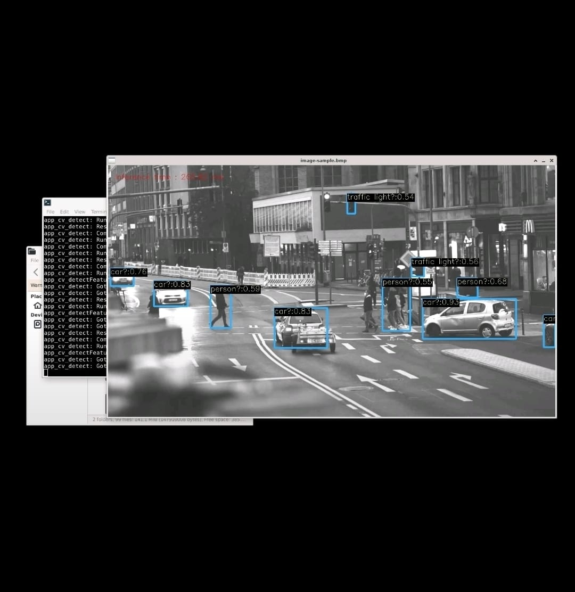
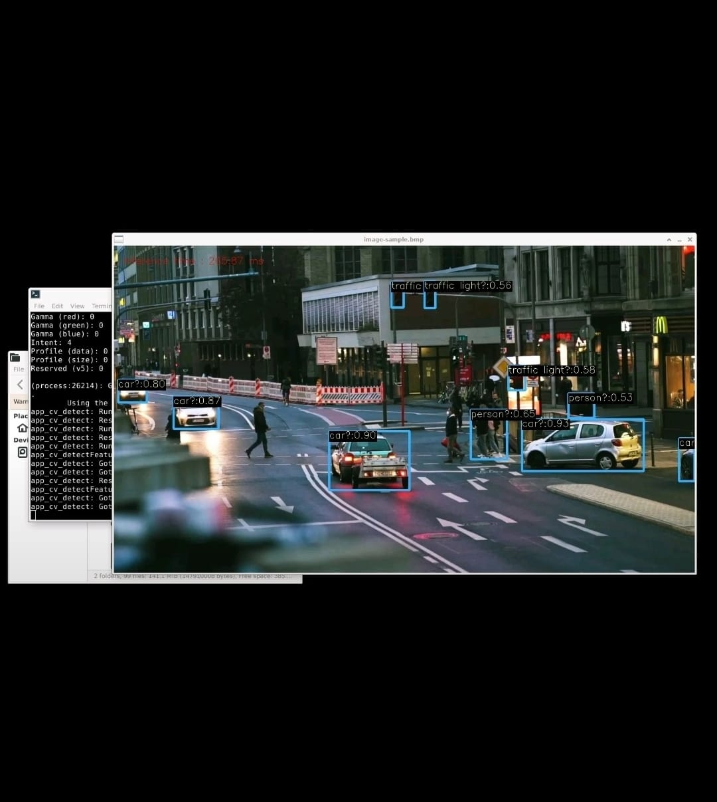

# Portfolio
This showcases some of my sample embedded computer vision work.

## Computer Vision
Image processing (made DSP filters from scratch)
 

Object detection
 

 

Object tracking

Tracking (cursor - Kalman filter tracker)
 
 

Streaming (built TCP streaming server from scratch for visual confirmation)

Streaming (Android ATAK application)
 
 

Streaming (Linux FFPlay application)
 
 

## Graphics
2D sine wave simulation
 

