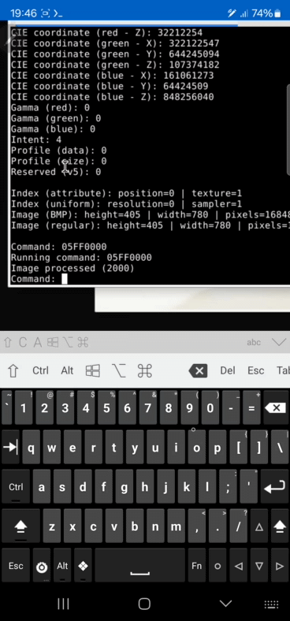
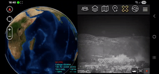
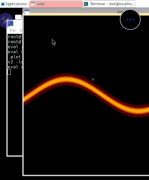

# Portfolio
This showcases some of my sample embedded computer vision work.

## Computer Vision
Image processing (made DSP filters from scratch)
 

Built TCP streaming server from scratch (streaming computer vision output for visual confirmation)

Streaming (Android ATAK application)
 
 

Streaming (Linux FFPlay application)
 
 

## Graphics
2D sine wave simulation
 

