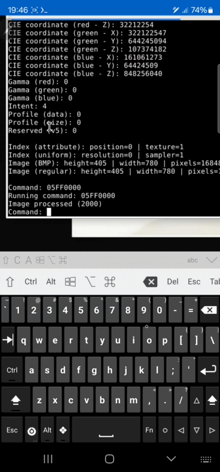
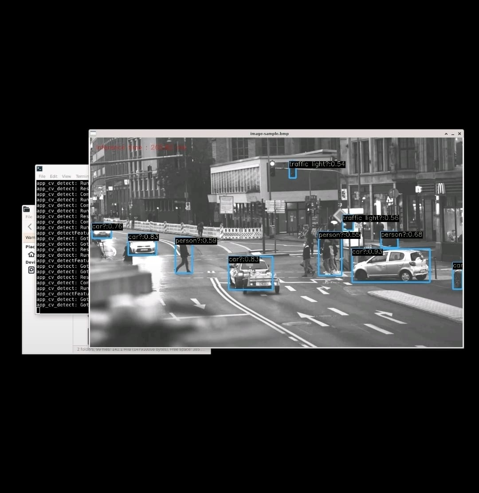
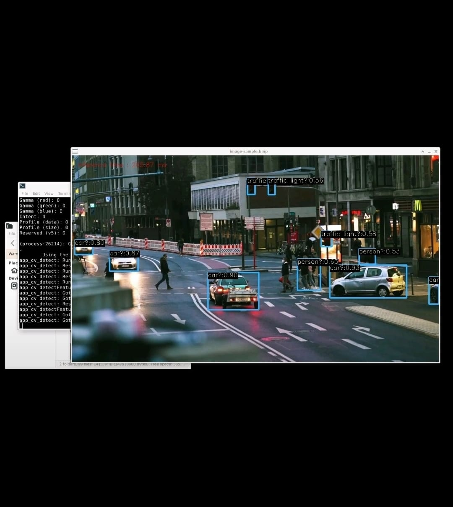
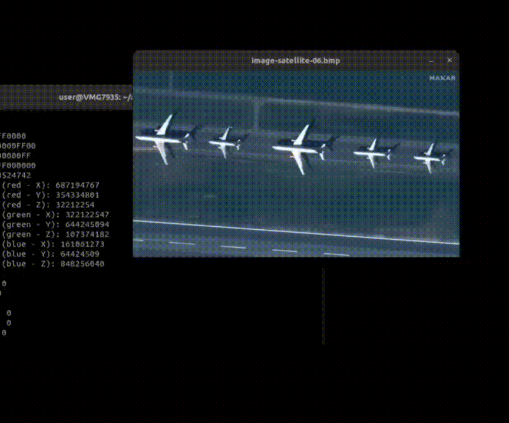
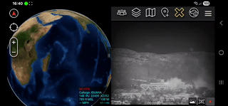
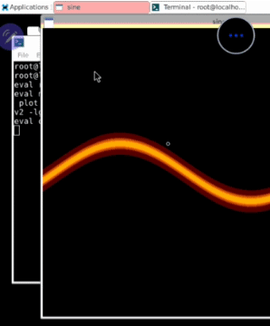

# Portfolio
This showcases some of my sample embedded computer vision work.

## Computer Vision
Image processing (created DSP filters from scratch)
 
 

Object detection

Detect (urban objects)
 
 

 

Detect (planes)
 
 

Object tracking

Track (AGM114 Hellfire missile)
 
 

Track (boats)
 
 

Track (boats - tankers)
 
 

Track (Leopold II tank)
 
 

Track (MQ9 Reaper drone)
 
 

Track (UGM109 Tomahawk missile)
 
 

Track (UGM133 Trident D5 II missile)
 
 

Track (cursor - custom Kalman filter)
 
 

## Miscellaneous
Streaming (built TCP streaming server from scratch for visual confirmation)

Streaming (Android ATAK application)
 
 

Streaming (Linux FFPlay application)
 
 

2D sine wave simulation
 
 

