# Portfolio
This showcases some of my sample embedded computer vision work.

## Computer Vision

### Object tracking

Track (AGM109 Black Arrow missile - 01)
 
 
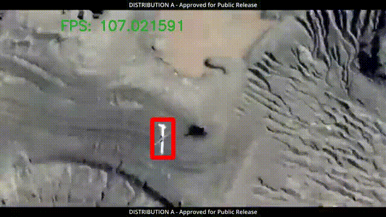

Track (AGM109 Black Arrow missile - 02)
 
 
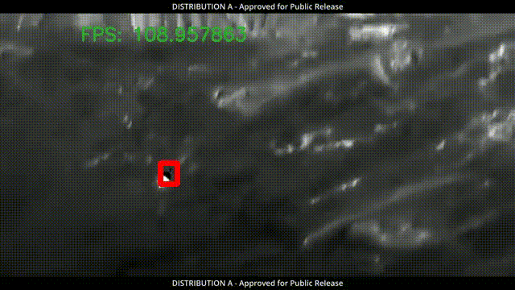

Track (AGM114 Hellfire missile - MQ9 Reaper)
 
 

Track (AGM189A - Barracuda 500M)
 
 

Track (AIM9 Sidewinder missile - F22 Raptor)
 
 
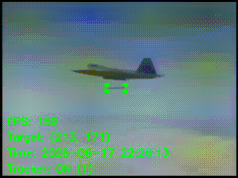

Track (Astra Mk 1 missile)
 
 
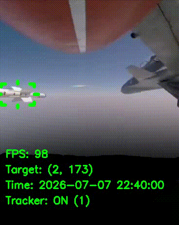

Track (Atmaca missile)
 
 
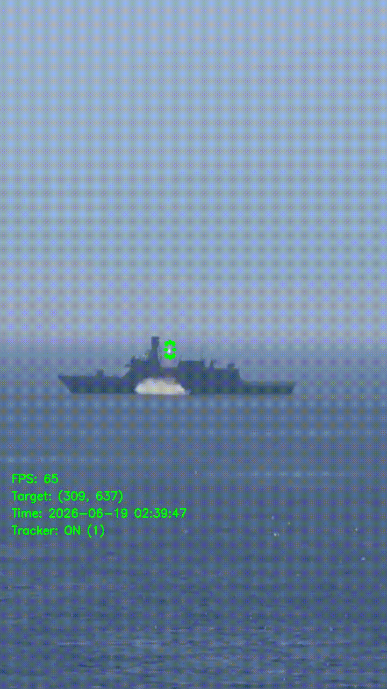

Track (Missile barrage - 01)
 
 
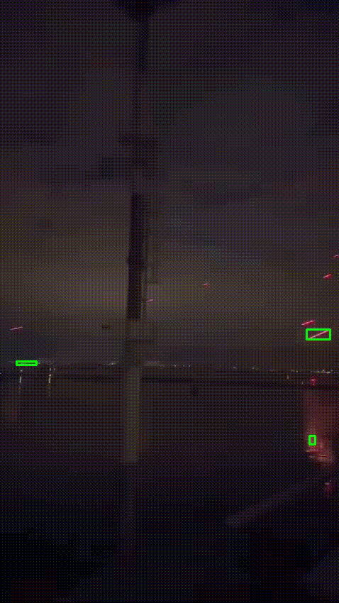

Track (Missile barrage - 02)
 
 
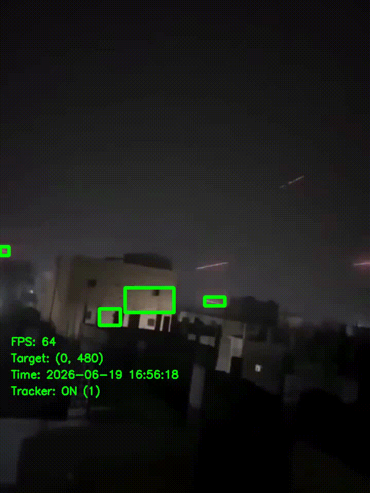

Track (Missile barrage - 03)
 
 
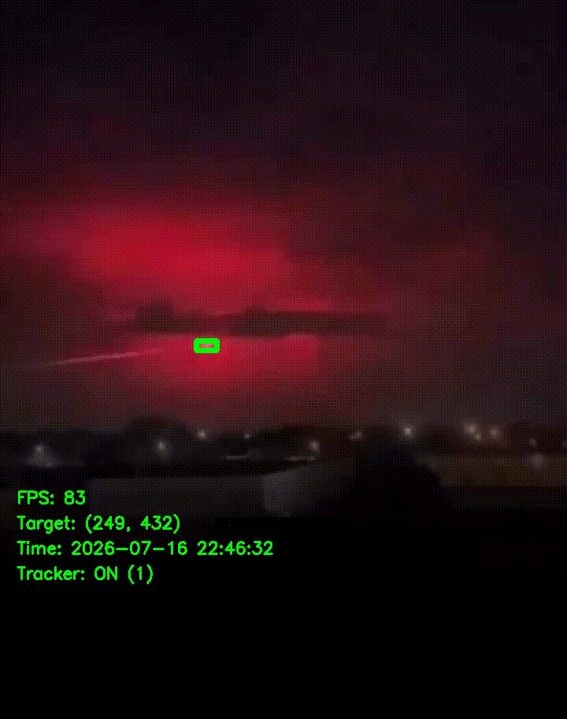

Track (P800 Onik missile - K300P Bastion)
 
 
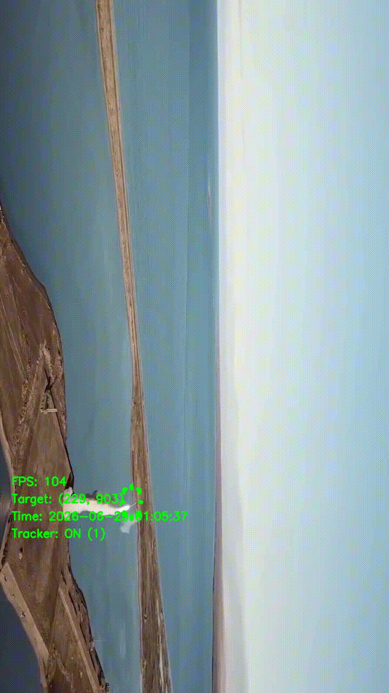

Track (KORKUT anti-aircraft gun (Turkey EFES 2026 military exercise))
 
 

Track (Leopold II tank)
 
 

Track (LGM30G Minuteman III missile)
 
 
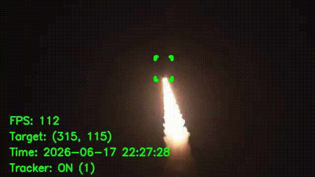

Track (Long Range Hypersonic Weapon Dark Eagle missile)
 
 
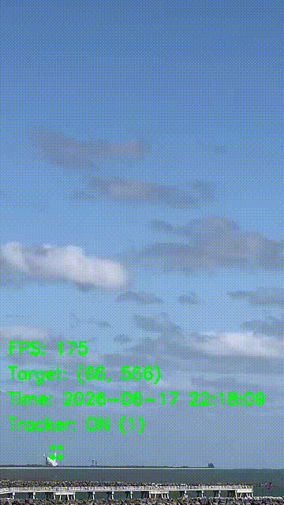

Track (M134 Minigun)
 
 

Track (M142 HIMARS ATACMS missile)
 
 
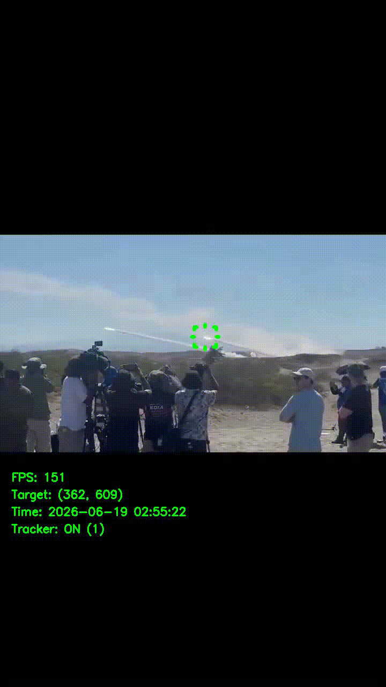

Track (M242 25 mm chaingun)
 
 

Track (MQ9 Reaper drone)
 
 

Track (Pinaka LRGR (Long Range Guided Rocket))
 
 
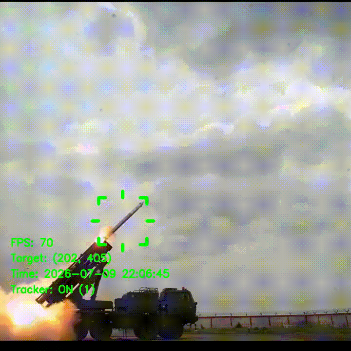

Track (SOM B1T missile)
 
 
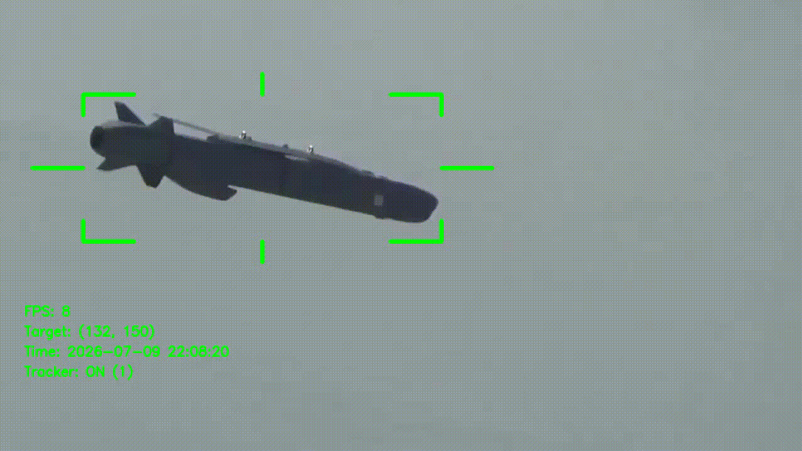

Track (UGM109 Tomahawk missile)
 
 

Track (UGM133 Trident D5 II missile)
 
 

Track (YFQ44A - FQ-44)
 
 
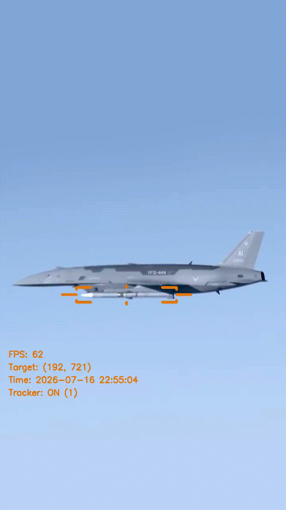

Track (.50 BMG Heavy Machine Gun)
 
 
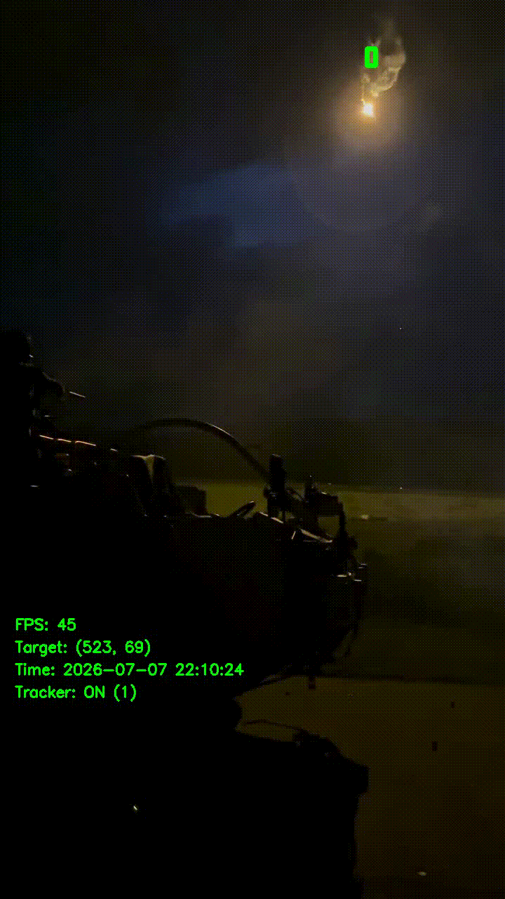

Track (boats)
 
 

Track (boats - tankers)
 
 

Track (cursor - custom Kalman filter)
 
 

### Object detection

Detect (urban objects)
 
 
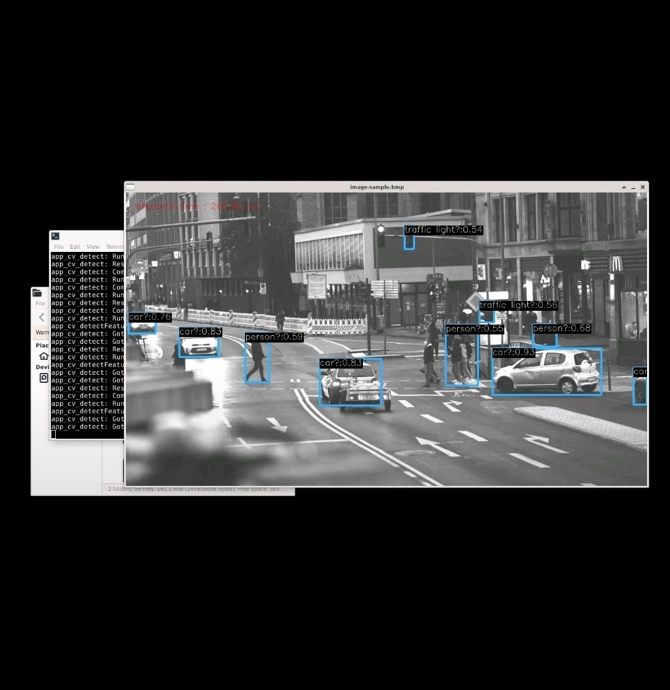
 
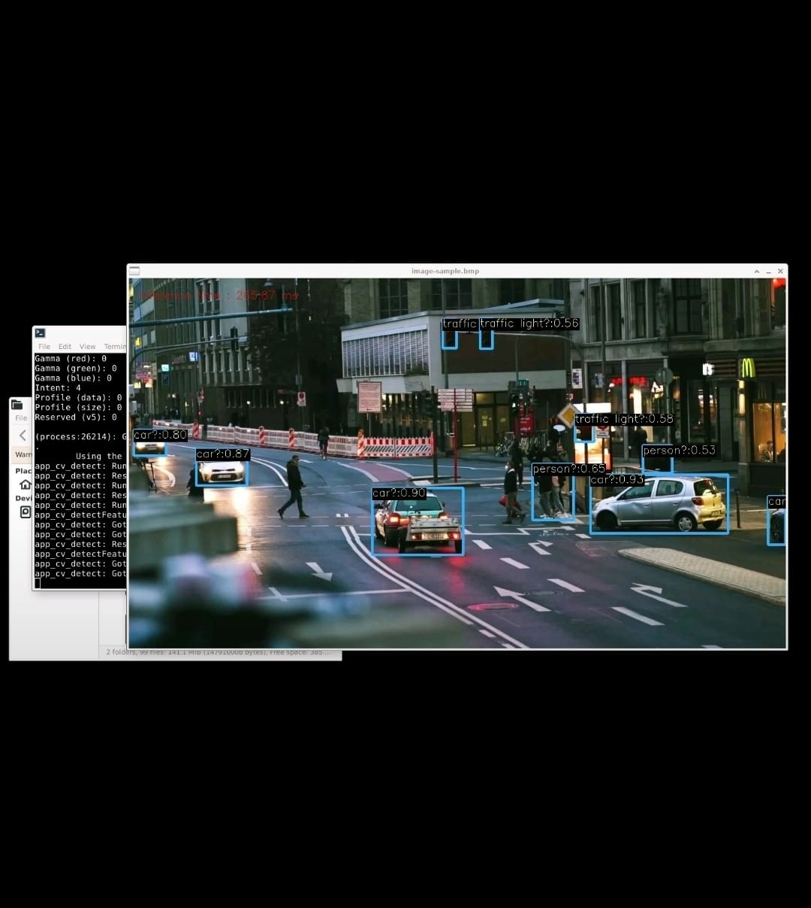

Detect (planes)
 
 
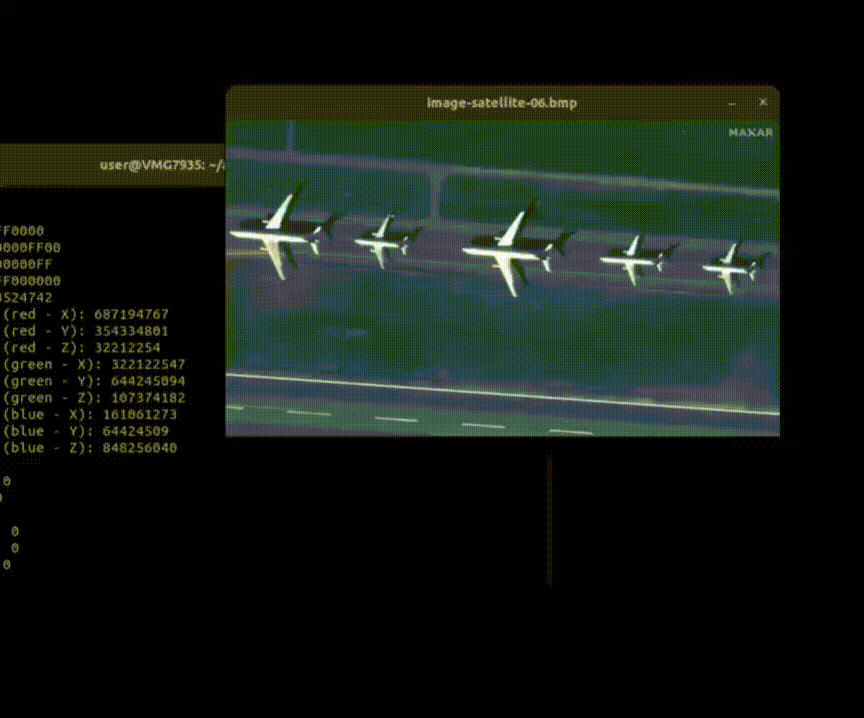

### Image processing 

Created DSP filters from scratch
 
 
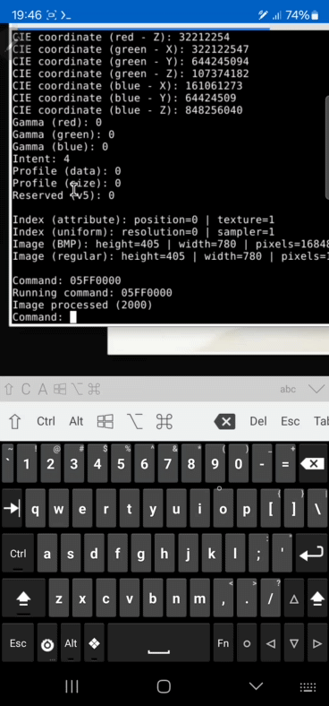

## Miscellaneous
Streaming (built TCP streaming server from scratch for visual confirmation)

Streaming (Android ATAK application)
 
 
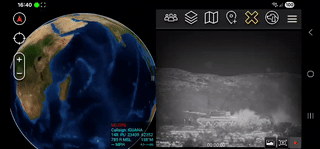

Streaming (Linux FFPlay application)
 
 

2D sine wave simulation
 
 
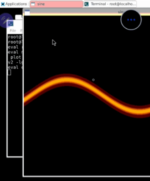

